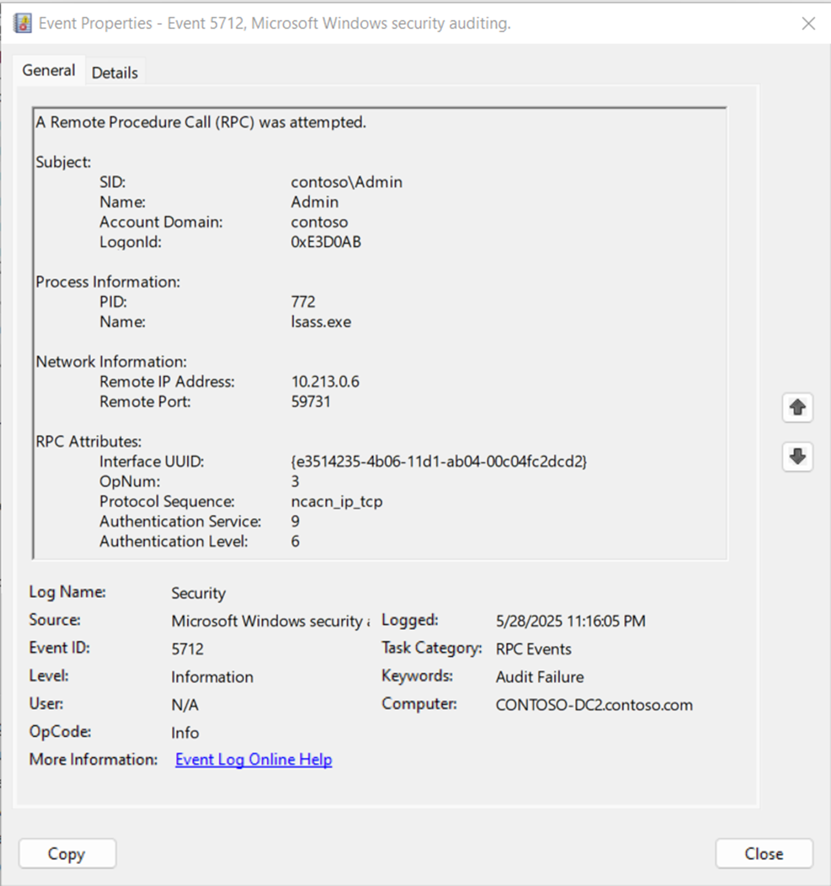
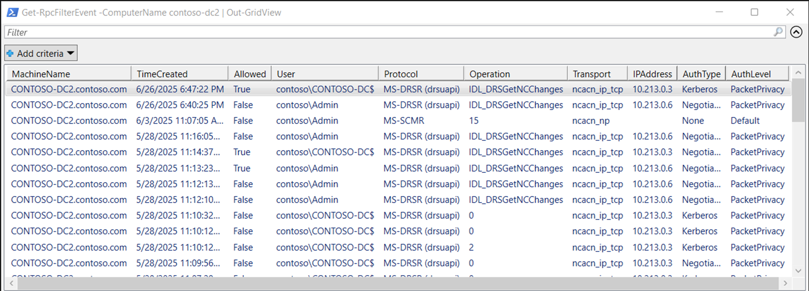

# RPC Filters Interop Assembly Project

[](../LICENSE)
[](#)
[](#)
[](#)
[](https://github.com/MichaelGrafnetter/RPCFilterManager/actions)

**A .NET library and PowerShell module for managing Windows RPC filters**

## Interop Assembly

[](https://www.nuget.org/packages/DSInternals.Win32.RpcFilters)

The [DSInternals.Win32.RpcFilters](https://www.nuget.org/packages/DSInternals.Win32.RpcFilters) library allows .NET applications to directly interact with Windows RPC Fiters,
part of the [Windows Filtering Platform (WFP)](https://learn.microsoft.com/en-us/windows/win32/fwp/windows-filtering-platform-start-page).

## PowerShell Module

[](https://www.powershellgallery.com/packages/DSInternals.RpcFilters/)
[](https://github.com/MichaelGrafnetter/RpcFilterManager/releases)

The [DSInternals.RpcFilters](https://www.powershellgallery.com/packages/DSInternals.RpcFilters) PowerShell module
exposes the functionality of the `DSInternals.Win32.RpcFilters` through PowerShell cmdlets.

## Examples

### PowerShell

The following example shows how the `DCSync` attack could be blocked on a Domain Controller using RPC filters:

```powershell
Import-Module -Name DSInternals.RpcFilters

# Create 3 RPC filters targeting the Directory Replication Service (DRS) Remote Protocol
New-RpcFilter -Name 'DCSync-Allow-DC01' -WellKnownOperation IDL_DRSGetNCChanges -IPAddress 10.0.0.1 -Action Permit -Persistent
New-RpcFilter -Name 'DCSync-Allow-DC02' -WellKnownOperation IDL_DRSGetNCChanges -IPAddress 10.0.0.2 -Action Permit -Persistent
New-RpcFilter -Name 'DCSync-Block-Default' -WellKnownOperation IDL_DRSGetNCChanges -Action Block -Persistent

# Check the current configuration
Get-RpcFilter

<# Sample output:
Name: DCSync-Allow-DC02
Description: RPC Filter
FilterId: 99321, FilterKey: 745889a1-207c-4ea0-8207-e97a8ad45b41, ProviderKey: N/A
Action: Permit
Audit: False, Persistent: True, BootTimeEnforced: False, Disabled: False
EffectiveWeight: 0x7e0000000001007, Weight: N/A
Conditions:
  Protocol = MS-DRSR
  Operation = IDL_DRSGetNCChanges (3)
  RemoteAddress = 10.0.0.2/32

Name: DCSync-Allow-DC01
Description: RPC Filter
FilterId: 99320, FilterKey: bc95f1b0-a1f6-4f01-a2d0-8e3d61619b3b, ProviderKey: N/A
Action: Permit
Audit: False, Persistent: True, BootTimeEnforced: False, Disabled: False
EffectiveWeight: 0x7e0000000001007, Weight: N/A
Conditions:
  Protocol = MS-DRSR
  Operation = IDL_DRSGetNCChanges (3)
  RemoteAddress = 10.0.0.1/32

Name: DCSync-Block-Default
Description: RPC Filter
FilterId: 99322, FilterKey: 5c9a49fd-706c-423d-bddf-75afbb2eb051, ProviderKey: N/A
Action: Block
Audit: False, Persistent: True, BootTimeEnforced: False, Disabled: False
EffectiveWeight: 0x7e0000000000007, Weight: N/A
Conditions:
  Protocol = MS-DRSR
  Operation = IDL_DRSGetNCChanges (3)
#>

# Remove the previously created filters
Get-RpcFilter | Where-Object Name -like 'DCSync-*' | Remove-RpcFilter
```

> [!TIP]
> More examples can be found in the [PowerShell module documentation](../Documentation/PowerShell/README.md).

### Comparison With the `netsh` Tool

The Windows built-in `netsh` tool [can also be used to manage RPC filters](https://learn.microsoft.com/en-us/windows-server/administration/windows-commands/netsh-rpc),
but it has many limitations:

- Filter names and descriptions cannot be set.
- Raw protocol UUIDs and OpNums must be used instead of well-known protocol and operation names.
- IP address conditions are not supported.
- Auditing cannot be enabled for blocked operations.

### C\#

The following example shows how RPC filters can be managed by the .NET interop library.

> [!IMPORTANT]
> This code is only meant to showcase all the possible parameters,
> so the resulting filter is not meaningful at all.

```cs
using DSInternals.Win32.RpcFilters;
using System.Net;

// Open a Windows Filtering Platform (WFP) session
using var fw = new RpcFilterManager();

// Fetch the effective list of RPC filters
var filters = fw.GetFilters();

// Register a new RPC filter
var filter = new RpcFilter()
{
    Name = "TestFilter",
    Description = "Test filter description",
    Action = RpcFilterAction.Permit,
    InterfaceUUID = WellKnownProtocols.RemoteRegistry.ToInterfaceUUID(),
    OperationNumber = 25,
    Transport = RpcProtocolSequence.ncacn_ip_tcp,
    NamedPipe = "\\PIPE\\winreg",
    LocalPort = 56345,
    DcomAppId = Guid.Parse("10000000-0000-0000-0000-000000000002"),
    SDDL = "D:(A;;CC;;;BA)",
    SecurityDescriptorNegativeMatch = true,
    Audit = true,
    IsPersistent = true,
    AuthenticationLevel = RpcAuthenticationLevel.PacketPrivacy,
    AuthenticationLevelMatchType = NumericMatchType.LessThan,
    AuthenticationType = RpcAuthenticationType.Kerberos,
    IsBootTimeEnforced = false,
    ImageName = "svchost.exe",
    RemoteAddress = IPAddress.Parse("fe80::bf1c:8c8e:f09d:c074"),
    LocalAddress = IPAddress.Parse("10.255.255.0"),
    LocalAddressMask = 24,
    Weight = 3
};

ulong id = fw.AddFilter(filter);

// Delete the freshly registered RPC filter
fw.RemoveFilter(id);
```

## Monitoring

To monitor blocked or permitted RPC operations, auditing for RPC events must be enabled first.
This can be done in multiple ways:

- The `auditpol.exe /set /subcategory:"RPC Events" /success:enable /failure:enable` command must be executed in an elevated command prompt  .
- The custom [Enable-RpcFilterAuditing](../Documentation/PowerShell/Enable-RpcFilterAuditing.md) cmdlet can be used in PowerShell.
- Administrators would prefer to use Active Directory Group Policy (Computer Configuration ⇒ Policies ⇒ Windows Settings ⇒ Security Settings ⇒ Advanced Audit Policy Configuration ⇒ System Audit Policies ⇒ Object Access ⇒ **Audit RPC Events**)

Once auditing is enabled, the corresponding RPC events will be created in the `Security` event log:



The [Get-RpcFilterEvent](../Documentation//PowerShell/Get-RpcFilterEvent.md) cmdlet can be used to fetch these RPC audit events,
and to translate most identifiers into human-readable names:



## Known Base Filtering Engine (BFE) Limitations

> [!WARNING]
> Several filter conditions are not evaluated by the filtering engine as expected or documented by Microsoft,
> leading to inconsistent behavior.

### OpNum Filtering

The ability to filter RPC operations by their operation number is only available on Windows 11 24H2 and Windows Server 2025 or later.
Although the underlying [FWPM_CONDITION_RPC_OPNUM](https://learn.microsoft.com/en-us/windows/win32/fwp/filtering-condition-identifiers-) filter condition
has been backported to Windows versions down to Windows Server 2019, it is ignored by the filtering engine on these older OS versions.

Windows Server 2016 and older systems do not even support operation number filtering at the API level
and reject attempts to create such filters by returning the `FWP_E_CONDITION_NOT_FOUND` error.
The same behavior can be observed in RTM versions of Windows Server 2019 and Windows Server 2022 before Windows Update is launched.

### Subnets

Filter conditions based on subnets, i.e. specifying IPv4 address masks or IPv6 prefix lengths, will not match any RPC traffic. The `FWP_MATCH_RANGE` operator does not work with IP addresses either.

### Named Pipe Case Sensitivity

Named pipe names are case sensitive. For example, a filter with the named pipe condition `\PIPE\WINREG` will not match
Remote Registry connections using the `\PIPE\winreg` named pipe.

Although the WFP API supports case-insensitive string comparisons through the `FWP_MATCH_EQUAL_CASE_INSENSITIVE` operator,
named pipe names are unfortunately stored as blobs instead of strings and thus only support the `FWP_MATCH_EQUAL` operator.

### Name Pipe IP Address Filtering

Filters containing IP address conditions will never match RPC over named pipe traffic. This might finally change in Windows 11 25H2.

### Named Pipe Authentication

The filtering engine sometimes identifies authentication type as `RPC_C_AUTHN_NONE` instead of `RPC_C_AUTHN_WINNT`
and authentication level as `RPC_C_AUTHN_LEVEL_DEFAULT` instead of `RPC_C_AUTHN_LEVEL_PKT_PRIVACY` for `ncacn_np` traffic.
This seems to be the case of the `MS-SCMR` protocol, while `MS-TSCH` and `MS-EVEN` behave as expected. Further investigation is required.

### Local RPC Calls

RPC filters typically do not apply to local RPC calls,
even when a filter condition explicitly targets the `ncalrpc` protocol sequence (transport layer).
The exact behavior is application-specific and might not always be intuitive:

```powershell
# This will bypass RPC filters:
Get-WinEvent -ListLog System

# But this will actually be caught by RPC filters:
Get-WinEvent -ComputerName localhost -ListLog System
```

## Tool Limitations

### Rule Weights

The .NET wrapper currently only supports relative weights in the 0-15 range when creating new filters.
Support for absolute weights in the 0-18446744073709551615 range is not yet implemented.

### Comparison Operators

Only the equality operator (`FWP_MATCH_EQUAL`) is currently supported for filter conditions by the tool.
Although [the WFP API supports a wide range of match types](https://learn.microsoft.com/en-us/windows/win32/api/fwptypes/ne-fwptypes-fwp_match_type), most of them are not even relevant for RPC filters.

## Author

### Michael Grafnetter

[](https://x.com/MGrafnetter)
[](https://www.dsinternals.com/en)
[](https://www.linkedin.com/in/grafnetter)

## Acknowledgements

- [Zero Networks: Stopping Lateral Movement via the RPC Firewall](https://zeronetworks.com/blog/stopping-lateral-movement-via-the-rpc-firewall)
- [Akamai: A Definitive Guide to the Remote Procedure Call (RPC) Filter](https://www.akamai.com/blog/security/guide-rpc-filter)
- [Google Project Zero: NtObjectManager](https://github.com/googleprojectzero/sandbox-attacksurface-analysis-tools)
