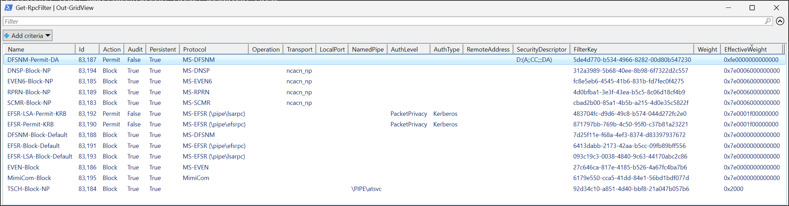
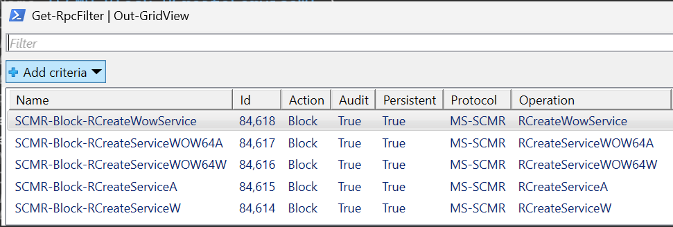
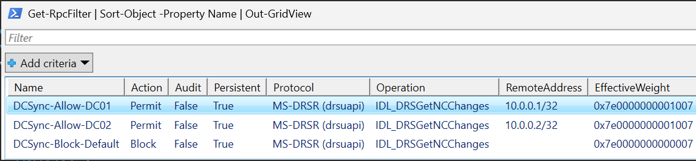

# DSInternals.RpcFilters Module

## Description

The `DSInternals.RpcFilters` PowerShell module provides cmdlets for managing remote procedure call (RPC) filters on Windows systems.

## DSInternals.RpcFilters Cmdlets

### [Disable-RpcFilterAuditing](Disable-RpcFilterAuditing.md)

Disables security auditing for RPC events.

### [Enable-RpcFilterAuditing](Enable-RpcFilterAuditing.md)

Enable security auditing for RPC events.

### [Get-RpcFilter](Get-RpcFilter.md)

Gets a list of RPC filters that match the specified criteria.

### [Get-RpcFilterEvent](Get-RpcFilterEvent.md)

Gets RPC audit events from the Security log.

### [New-RpcFilter](New-RpcFilter.md)

Creates a new RPC filter for managing remote procedure call (RPC) traffic based on specified criteria.

### [Remove-RpcFilter](Remove-RpcFilter.md)

Removes an existing remote procedure call (RPC) filter.

## Domain Controller Hardening Example

The following script contains sample RPC filters that could be used as part of a Domain Controller hardening strategy.
It blocks remote command execution over SMB named pipes and mitigates several NTLM relay attack techniques,
including PetitPotam, PrinterBug, and DFSCoerce.

```powershell
# Block the Service Control Manager Remote Protocol (MS-SCMR) over SMB named pipes:
New-RpcFilter `
    -Name 'SCMR-Block-NP' `
    -Description 'Block service management (MS-SCMR) over named pipes' `
    -WellKnownProtocol ServiceControlManager `
    -Transport ncacn_np `
    -Action Block `
    -Persistent `
    -Audit

# Block remote scheduled task management (MS-TSCH) over SMB named pipes:
New-RpcFilter `
    -Name 'TSCH-Block-NP' `
    -Description 'Block scheduled task management (MS-TSCH) over named pipes' `
    -NamedPipe '\PIPE\atsvc' `
    -Action Block `
    -Persistent `
    -Audit

# Block remote event log access (MS-EVEN6) over SMB named pipes:
New-RpcFilter `
    -Name 'EVEN6-Block-NP' `
    -Description 'Block event log access (MS-EVEN6) over named pipes' `
    -WellKnownProtocol EventLogV6 `
    -Transport ncacn_np `
    -Action Block `
    -Persistent `
    -Audit

# Block the legacy MS-EVEN protocol traffic:
New-RpcFilter `
    -Name 'EVEN-Block' `
    -Description 'Block legacy event log protocol (MS-EVEN)' `
    -WellKnownProtocol EventLog `
    -Action Block `
    -Persistent `
    -Audit

# Allow DFS namespace management (MS-DFSNM) for Domain Admins, but block it for everyone else:
New-RpcFilter `
    -Name 'DFSNM-Permit-DA' `
    -Description 'Allow MS-DFSNM for Domain Admins' `
    -WellKnownProtocol NamespaceManagement `
    -SecurityDescriptor 'D:(A;;CC;;;DA)' `
    -Action Permit `
    -Persistent

New-RpcFilter `
    -Name 'DFSNM-Block-Default' `
    -Description 'Block MS-DFSNM by default' `
    -WellKnownProtocol NamespaceManagement `
    -Action Block `
    -Persistent `
    -Audit

# Block the Print System Remote Protocol (MS-RPRN) over SMB named pipes:
New-RpcFilter `
    -Name 'RPRN-Block-NP' `
    -Description 'Block print spooler (MS-RPRN) over named pipes' `
    -WellKnownProtocol PrintSpooler `
    -Transport ncacn_np `
    -Action Block `
    -Persistent `
    -Audit

# Enforce Kerberos and packet encryption for the Encrypting File System Remote Protocol (MS-EFSR):
New-RpcFilter `
    -Name 'EFSR-Permit-KRB' `
    -Description 'Permit MS-EFSR over the efsrpc named pipe when Kerberos and encryption are used' `
    -WellKnownProtocol EncryptingFileSystem `
    -AuthenticationType Kerberos `
    -AuthenticationLevel PacketPrivacy `
    -Action Permit `
    -Persistent

New-RpcFilter `
    -Name 'EFSR-Block-Default' `
    -Description 'Block MS-EFSR over the efsrpc named pipe by default' `
    -WellKnownProtocol EncryptingFileSystem `
    -Action Block `
    -Persistent `
    -Audit

New-RpcFilter `
    -Name 'EFSR-LSA-Permit-KRB' `
    -Description 'Permit MS-EFSR over the lsarpc named pipe when Kerberos and encryption are used' `
    -WellKnownProtocol EncryptingFileSystemLSA `
    -AuthenticationType Kerberos `
    -AuthenticationLevel PacketPrivacy `
    -Action Permit `
    -Persistent

New-RpcFilter `
    -Name 'EFSR-LSA-Block-Default' `
    -Description 'Block MS-EFSR over the lsarpc named pipe by default' `
    -WellKnownProtocol EncryptingFileSystemLSA `
    -Action Block `
    -Persistent `
    -Audit

# Block DNS server management (MS-DNSP) over SMB named pipes:
New-RpcFilter `
    -Name 'DNSP-Block-NP' `
    -Description 'Block DNS server management (MS-DNSP) over named pipes' `
    -WellKnownProtocol DnsManagement `
    -Transport ncacn_np `
    -Action Block `
    -Persistent `
    -Audit

# Block the Mimikatz Command and Control (C2) channel:
New-RpcFilter `
    -Name 'MimiCom-Block' `
    -Description 'Block Mimikatz C2' `
    -WellKnownProtocol MimiCom `
    -Action Block `
    -Audit `
    -Persistent
```

The resulting RPC filters can be viewed using the `Get-RpcFilter` cmdlet:

```powershell
Get-RpcFilter | Sort-Object -Property EffectiveWeight -Descending
```

```txt
Name: DFSNM-Permit-DA
Description: Allow MS-DFSNM for Domain Admins
FilterId: 83187, FilterKey: 5de4d770-b534-4966-8282-00d80b547230, ProviderKey: N/A
Action: Permit
Audit: False, Persistent: True, BootTimeEnforced: False, Disabled: False
EffectiveWeight: 0xfe0000000000000, Weight: N/A
Conditions:
  Protocol = MS-DFSNM - {4fc742e0-4a10-11cf-8273-00aa004ae673}
  SecurityDescriptor = D:(A;;CC;;;DA)

Name: SCMR-Block-NP
Description: Block service management (MS-SCMR) over named pipes
FilterId: 83183, FilterKey: cbad2b00-85a1-4b5b-a215-4d0e35c5822f, ProviderKey: N/A
Action: Block
Audit: True, Persistent: True, BootTimeEnforced: False, Disabled: False
EffectiveWeight: 0x7e0006000000000, Weight: N/A
Conditions:
  Protocol = MS-SCMR - {367abb81-9844-35f1-ad32-98f038001003}
  Transport = ncacn_np

Name: DNSP-Block-NP
Description: Block DNS server management (MS-DNSP) over named pipes
FilterId: 83194, FilterKey: 312a3989-5b68-40ee-8b98-6f7322d2c557, ProviderKey: N/A
Action: Block
Audit: True, Persistent: True, BootTimeEnforced: False, Disabled: False
EffectiveWeight: 0x7e0006000000000, Weight: N/A
Conditions:
  Protocol = MS-DNSP - {50abc2a4-574d-40b3-9d66-ee4fd5fba076}
  Transport = ncacn_np

Name: RPRN-Block-NP
Description: Block print spooler (MS-RPRN) over named pipes
FilterId: 83189, FilterKey: 4d0bfba1-3e3f-43ea-b5c5-8c06d18cf4b9, ProviderKey: N/A
Action: Block
Audit: True, Persistent: True, BootTimeEnforced: False, Disabled: False
EffectiveWeight: 0x7e0006000000000, Weight: N/A
Conditions:
  Protocol = MS-RPRN - {12345678-1234-abcd-ef00-0123456789ab}
  Transport = ncacn_np

Name: EVEN6-Block-NP
Description: Block event log access (MS-EVEN6) over named pipes
FilterId: 83185, FilterKey: fc8e5eb6-4545-41b6-831b-fd7fec0f4275, ProviderKey: N/A
Action: Block
Audit: True, Persistent: True, BootTimeEnforced: False, Disabled: False
EffectiveWeight: 0x7e0006000000000, Weight: N/A
Conditions:
  Protocol = MS-EVEN6 - {f6beaff7-1e19-4fbb-9f8f-b89e2018337c}
  Transport = ncacn_np

Name: EFSR-LSA-Permit-KRB
Description: Permit MS-EFSR over the lsarpc named pipe when Kerberos and encryption are used
FilterId: 83192, FilterKey: 483704fc-d9d6-49c8-b574-044d272fc2e0, ProviderKey: N/A
Action: Permit
Audit: False, Persistent: True, BootTimeEnforced: False, Disabled: False
EffectiveWeight: 0x7e0001f00000000, Weight: N/A
Conditions:
  Protocol = MS-EFSR (\pipe\lsarpc) - {c681d488-d850-11d0-8c52-00c04fd90f7e}
  AuthenticationLevel = PacketPrivacy
  AuthenticationType = Kerberos

Name: EFSR-Permit-KRB
Description: Permit MS-EFSR over the efsrpc named pipe when Kerberos and encryption are used
FilterId: 83190, FilterKey: 871797bb-769b-4c50-95f0-c37b81a23221, ProviderKey: N/A
Action: Permit
Audit: False, Persistent: True, BootTimeEnforced: False, Disabled: False
EffectiveWeight: 0x7e0001f00000000, Weight: N/A
Conditions:
  Protocol = MS-EFSR (\pipe\efsrpc) - {df1941c5-fe89-4e79-bf10-463657acf44d}
  AuthenticationLevel = PacketPrivacy
  AuthenticationType = Kerberos

Name: EFSR-LSA-Block-Default
Description: Block MS-EFSR over the lsarpc named pipe by default
FilterId: 83193, FilterKey: 093c19c3-0038-4840-9c63-44170abc2c86, ProviderKey: N/A
Action: Block
Audit: True, Persistent: True, BootTimeEnforced: False, Disabled: False
EffectiveWeight: 0x7e0000000000000, Weight: N/A
Conditions:
  Protocol = MS-EFSR (\pipe\lsarpc) - {c681d488-d850-11d0-8c52-00c04fd90f7e}

Name: MimiCom-Block
Description: Block Mimikatz C2
FilterId: 83195, FilterKey: 6179e550-cca5-41dd-84e1-56bd1bdf077d, ProviderKey: N/A
Action: Block
Audit: True, Persistent: True, BootTimeEnforced: False, Disabled: False
EffectiveWeight: 0x7e0000000000000, Weight: N/A
Conditions:
  Protocol = MimiCom - {17fc11e9-c258-4b8d-8d07-2f4125156244}

Name: EFSR-Block-Default
Description: Block MS-EFSR over the efsrpc named pipe by default
FilterId: 83191, FilterKey: 6413dabb-2173-42aa-b5cc-09fb89bff556, ProviderKey: N/A
Action: Block
Audit: True, Persistent: True, BootTimeEnforced: False, Disabled: False
EffectiveWeight: 0x7e0000000000000, Weight: N/A
Conditions:
  Protocol = MS-EFSR (\pipe\efsrpc) - {df1941c5-fe89-4e79-bf10-463657acf44d}

Name: DFSNM-Block-Default
Description: Block MS-DFSNM by default
FilterId: 83188, FilterKey: 7d25f11e-f68a-4ef3-8374-d83397937672, ProviderKey: N/A
Action: Block
Audit: True, Persistent: True, BootTimeEnforced: False, Disabled: False
EffectiveWeight: 0x7e0000000000000, Weight: N/A
Conditions:
  Protocol = MS-DFSNM - {4fc742e0-4a10-11cf-8273-00aa004ae673}

Name: EVEN-Block
Description: Block legacy event log protocol (MS-EVEN)
FilterId: 83186, FilterKey: 27c646ca-817e-4185-b526-4a67fc4ba7b6, ProviderKey: N/A
Action: Block
Audit: True, Persistent: True, BootTimeEnforced: False, Disabled: False
EffectiveWeight: 0x7e0000000000000, Weight: N/A
Conditions:
  Protocol = MS-EVEN - {82273fdc-e32a-18c3-3f78-827929dc23ea}

Name: TSCH-Block-NP
Description: Block scheduled task management (MS-TSCH) over named pipes
FilterId: 83184, FilterKey: 92d34c10-a851-4d40-bbf8-21a047b057b6, ProviderKey: N/A
Action: Block
Audit: True, Persistent: True, BootTimeEnforced: False, Disabled: False
EffectiveWeight: 0x2000, Weight: N/A
Conditions:
  NamedPipe = \PIPE\atsvc
```

The `Out-GridView` cmdlet can provide a more user-friendly view:

```powershell
Get-RPCFilter | Out-GridView
```



The same filters can also displayed by using the built-in `netsh` command:

 ```cmd
 netsh rpc filter show filter
 ```

```txt
Listing all RPC Filters.
---------------------------------
filterKey: 312a3989-5b68-40ee-8b98-6f7322d2c557
displayData.name: DNSP-Block-NP
displayData.description: Block DNS server management (MS-DNSP) over named pipes
filterId: 0x144fa
layerKey: um
weight: Type: FWP_EMPTY Value: Empty
action.type: block
Audit: Enable
numFilterConditions: 2

filterCondition[0]
        fieldKey: protocol
        matchType: FWP_MATCH_EQUAL
        conditionValue: Type: FWP_UINT8 Value: 2

filterCondition[1]
        fieldKey: if_uuid
        matchType: FWP_MATCH_EQUAL
        conditionValue: Type: FWP_BYTE_ARRAY16_TYPE Value: 50abc2a4 40b3574d 4fee669d 76a0fbd5

---------------------------------
filterKey: 4d0bfba1-3e3f-43ea-b5c5-8c06d18cf4b9
displayData.name: RPRN-Block-NP
displayData.description: Block print spooler (MS-RPRN) over named pipes
filterId: 0x144f5
layerKey: um
weight: Type: FWP_EMPTY Value: Empty
action.type: block
Audit: Enable
numFilterConditions: 2

filterCondition[0]
        fieldKey: protocol
        matchType: FWP_MATCH_EQUAL
        conditionValue: Type: FWP_UINT8 Value: 2

filterCondition[1]
        fieldKey: if_uuid
        matchType: FWP_MATCH_EQUAL
        conditionValue: Type: FWP_BYTE_ARRAY16_TYPE Value: 12345678 abcd1234 230100ef ab896745

---------------------------------
filterKey: fc8e5eb6-4545-41b6-831b-fd7fec0f4275
displayData.name: EVEN6-Block-NP
displayData.description: Block event log access (MS-EVEN6) over named pipes
filterId: 0x144f1
layerKey: um
weight: Type: FWP_EMPTY Value: Empty
action.type: block
Audit: Enable
numFilterConditions: 2

filterCondition[0]
        fieldKey: protocol
        matchType: FWP_MATCH_EQUAL
        conditionValue: Type: FWP_UINT8 Value: 2

filterCondition[1]
        fieldKey: if_uuid
        matchType: FWP_MATCH_EQUAL
        conditionValue: Type: FWP_BYTE_ARRAY16_TYPE Value: f6beaff7 4fbb1e19 9eb88f9f 7c331820

---------------------------------
filterKey: cbad2b00-85a1-4b5b-a215-4d0e35c5822f
displayData.name: SCMR-Block-NP
displayData.description: Block service management (MS-SCMR) over named pipes
filterId: 0x144ef
layerKey: um
weight: Type: FWP_EMPTY Value: Empty
action.type: block
Audit: Enable
numFilterConditions: 2

filterCondition[0]
        fieldKey: protocol
        matchType: FWP_MATCH_EQUAL
        conditionValue: Type: FWP_UINT8 Value: 2

filterCondition[1]
        fieldKey: if_uuid
        matchType: FWP_MATCH_EQUAL
        conditionValue: Type: FWP_BYTE_ARRAY16_TYPE Value: 367abb81 35f19844 f09832ad 03100038

---------------------------------
filterKey: 6179e550-cca5-41dd-84e1-56bd1bdf077d
displayData.name: MimiCom-Block
displayData.description: Block Mimikatz C2
filterId: 0x144fb
layerKey: um
weight: Type: FWP_EMPTY Value: Empty
action.type: block
Audit: Enable
numFilterConditions: 1

filterCondition[0]
        fieldKey: if_uuid
        matchType: FWP_MATCH_EQUAL
        conditionValue: Type: FWP_BYTE_ARRAY16_TYPE Value: 17fc11e9 4b8dc258 412f078d 44621525

---------------------------------
filterKey: 093c19c3-0038-4840-9c63-44170abc2c86
displayData.name: EFSR-LSA-Block-Default
displayData.description: Block MS-EFSR over the lsarpc named pipe by default
filterId: 0x144f9
layerKey: um
weight: Type: FWP_EMPTY Value: Empty
action.type: block
Audit: Enable
numFilterConditions: 1

filterCondition[0]
        fieldKey: if_uuid
        matchType: FWP_MATCH_EQUAL
        conditionValue: Type: FWP_BYTE_ARRAY16_TYPE Value: c681d488 11d0d850 c000528c 7e0fd94f

---------------------------------
filterKey: 6413dabb-2173-42aa-b5cc-09fb89bff556
displayData.name: EFSR-Block-Default
displayData.description: Block MS-EFSR over the efsrpc named pipe by default
filterId: 0x144f7
layerKey: um
weight: Type: FWP_EMPTY Value: Empty
action.type: block
Audit: Enable
numFilterConditions: 1

filterCondition[0]
        fieldKey: if_uuid
        matchType: FWP_MATCH_EQUAL
        conditionValue: Type: FWP_BYTE_ARRAY16_TYPE Value: df1941c5 4e79fe89 364610bf 4df4ac57

---------------------------------
filterKey: 7d25f11e-f68a-4ef3-8374-d83397937672
displayData.name: DFSNM-Block-Default
displayData.description: Block MS-DFSNM by default
filterId: 0x144f4
layerKey: um
weight: Type: FWP_EMPTY Value: Empty
action.type: block
Audit: Enable
numFilterConditions: 1

filterCondition[0]
        fieldKey: if_uuid
        matchType: FWP_MATCH_EQUAL
        conditionValue: Type: FWP_BYTE_ARRAY16_TYPE Value: 4fc742e0 11cf4a10 aa007382 73e64a00

---------------------------------
filterKey: 27c646ca-817e-4185-b526-4a67fc4ba7b6
displayData.name: EVEN-Block
displayData.description: Block legacy event log protocol (MS-EVEN)
filterId: 0x144f2
layerKey: um
weight: Type: FWP_EMPTY Value: Empty
action.type: block
Audit: Enable
numFilterConditions: 1

filterCondition[0]
        fieldKey: if_uuid
        matchType: FWP_MATCH_EQUAL
        conditionValue: Type: FWP_BYTE_ARRAY16_TYPE Value: 82273fdc 18c3e32a 7982783f ea23dc29

---------------------------------
filterKey: 92d34c10-a851-4d40-bbf8-21a047b057b6
displayData.name: TSCH-Block-NP
displayData.description: Block scheduled task management (MS-TSCH) over named pipes
filterId: 0x144f0
layerKey: um
weight: Type: FWP_EMPTY Value: Empty
action.type: block
Audit: Enable
numFilterConditions: 1

filterCondition[0]
        fieldKey: pipe
        matchType: FWP_MATCH_EQUAL
        conditionValue: Type: FWP_BYTE_BLOB_TYPE Value: \PIPE\atsvc

---------------------------------
filterKey: 5de4d770-b534-4966-8282-00d80b547230
displayData.name: DFSNM-Permit-DA
displayData.description: Allow MS-DFSNM for Domain Admins
filterId: 0x144f3
layerKey: um
weight: Type: FWP_EMPTY Value: Empty
action.type: permit
numFilterConditions: 2

filterCondition[0]
        fieldKey: if_uuid
        matchType: FWP_MATCH_EQUAL
        conditionValue: Type: FWP_BYTE_ARRAY16_TYPE Value: 4fc742e0 11cf4a10 aa007382 73e64a00

filterCondition[1]
        fieldKey: remote_user_token
        matchType: FWP_MATCH_EQUAL
        conditionValue: Type: FWP_TOKEN_ACCESS_INFORMATION_TYPE Value: s

---------------------------------
filterKey: 483704fc-d9d6-49c8-b574-044d272fc2e0
displayData.name: EFSR-LSA-Permit-KRB
displayData.description: Permit MS-EFSR over the lsarpc named pipe when Kerberos and encryption are used
filterId: 0x144f8
layerKey: um
weight: Type: FWP_EMPTY Value: Empty
action.type: permit
numFilterConditions: 3

filterCondition[0]
        fieldKey: auth_level
        matchType: FWP_MATCH_EQUAL
        conditionValue: Type: FWP_UINT8 Value: 6

filterCondition[1]
        fieldKey: auth_type
        matchType: FWP_MATCH_EQUAL
        conditionValue: Type: FWP_UINT8 Value: 16

filterCondition[2]
        fieldKey: if_uuid
        matchType: FWP_MATCH_EQUAL
        conditionValue: Type: FWP_BYTE_ARRAY16_TYPE Value: c681d488 11d0d850 c000528c 7e0fd94f

---------------------------------
filterKey: 871797bb-769b-4c50-95f0-c37b81a23221
displayData.name: EFSR-Permit-KRB
displayData.description: Permit MS-EFSR over the efsrpc named pipe when Kerberos and encryption are used
filterId: 0x144f6
layerKey: um
weight: Type: FWP_EMPTY Value: Empty
action.type: permit
numFilterConditions: 3

filterCondition[0]
        fieldKey: auth_level
        matchType: FWP_MATCH_EQUAL
        conditionValue: Type: FWP_UINT8 Value: 6

filterCondition[1]
        fieldKey: auth_type
        matchType: FWP_MATCH_EQUAL
        conditionValue: Type: FWP_UINT8 Value: 16

filterCondition[2]
        fieldKey: if_uuid
        matchType: FWP_MATCH_EQUAL
        conditionValue: Type: FWP_BYTE_ARRAY16_TYPE Value: df1941c5 4e79fe89 364610bf 4df4ac57
```

The EFS-related filters could be rewritten to use the `Block` action exclusively:

```powershell
New-RpcFilter `
    -Name 'EFSR-Block-NTLM' `
    -Description 'Block MS-EFSR over the efsrpc named pipe when NTLM is used' `
    -WellKnownProtocol EncryptingFileSystem `
    -AuthenticationType NTLM `
    -Action Block `
    -Persistent `
    -Audit

New-RpcFilter `
    -Name 'EFSR-Block-Unencrypted' `
    -Description 'Block unencrypted MS-EFSR traffic over the efsrpc named pipe' `
    -WellKnownProtocol EncryptingFileSystem `
    -AuthenticationLevel PacketPrivacy `
    -AuthenticationLevelMatchType LessThan `
    -Action Block `
    -Persistent `
    -Audit

New-RpcFilter `
    -Name 'EFSR-LSA-Block-NTLM' `
    -Description 'Block MS-EFSR over the lsarpc named pipe when NTLM is used' `
    -WellKnownProtocol EncryptingFileSystemLSA `
    -AuthenticationType NTLM `
    -Action Block `
    -Persistent `
    -Audit

New-RpcFilter `
    -Name 'EFSR-LSA-Block-Unencrypted' `
    -Description 'Block unencrypted MS-EFSR traffic over the lsarpc named pipe' `
    -WellKnownProtocol EncryptingFileSystemLSA `
    -AuthenticationLevel PacketPrivacy `
    -AuthenticationLevelMatchType LessThan `
    -Action Block `
    -Persistent `
    -Audit
```

Similar approach could be taken for the DFS namespace management protocol:

```powershell
New-RpcFilter `
    -Name 'DFSNM-Block-Non-DA' `
    -Description 'Block MS-DFSNM for non-Domain Admins' `
    -WellKnownProtocol NamespaceManagement `
    -SecurityDescriptor 'D:(A;;CC;;;DA)' `
    -SecurityDescriptorNegativeMatch `
    -Action Block `
    -Persistent `
    -Audit
```

> [!TIP]
> See the [Active Directory Firewall project](https://firewall.dsinternals.com) for more comprehensive guidelines
> on configuring Windows Firewall on Domain Controllers.

## OpNum Filter Examples

On Windows Server 2025 and later, specific RPC operations can be blocked.

### Event Log Protection

Here is how event logs could be protected from being remotely cleared over the MS-EVEN6 protocol:

```powershell
New-RpcFilter `
    -Name 'EVEN6-Block-Clear' `
    -Description 'Block remote event log clearing over MS-EVEN6' `
    -WellKnownOperation EvtRpcClearLog `
    -Action Block `
    -Audit `
    -Persistent `
    -PassThrough
```

```txt
Name: EVEN6-Block-Clear
Description: Block remote event log clearing over MS-EVEN6
FilterId: 84589, FilterKey: 96ff350f-9710-4de5-bb44-3fdf4ffe447f, ProviderKey: N/A
Action: Block
Audit: True, Persistent: True, BootTimeEnforced: False, Disabled: False
EffectiveWeight: 0x, Weight: N/A
Conditions:
  Protocol = MS-EVEN6 - {f6beaff7-1e19-4fbb-9f8f-b89e2018337c}
  Operation = EvtRpcClearLog (6)
```

The `netsh` command can also display opnum filter conditions:

```cmd
netsh rpc filter show filter
```

```txt
Listing all RPC Filters.
---------------------------------
filterKey: 96ff350f-9710-4de5-bb44-3fdf4ffe447f
displayData.name: EVEN6-Block-Clear
displayData.description: Block remote event log clearing over MS-EVEN6
filterId: 0x14a6d
layerKey: um
weight: Type: FWP_EMPTY Value: Empty
action.type: block
Audit: Enable
numFilterConditions: 2

filterCondition[0]
        fieldKey: if_uuid
        matchType: FWP_MATCH_EQUAL
        conditionValue: Type: FWP_BYTE_ARRAY16_TYPE Value: f6beaff7 4fbb1e19 9eb88f9f 7c331820

filterCondition[1]
        fieldKey: opnum
        matchType: FWP_MATCH_EQUAL
        conditionValue: Type: FWP_UINT16 Value: 6
```

### Blocking Remote Service Creation

Blocking remote service creation is a more challenging task,
because multiple RPC operations provide this functionality:

```powershell
New-RpcFilter `
    -Name 'SCMR-Block-RCreateServiceW' `
    -Description 'Block remote service creation using the RCreateServiceW call' `
    -WellKnownOperation RCreateServiceW `
    -Action Block `
    -Audit `
    -Persistent

New-RpcFilter `
    -Name 'SCMR-Block-RCreateServiceA' `
    -Description 'Block remote service creation using the RCreateServiceA call' `
    -WellKnownOperation RCreateServiceA `
    -Action Block `
    -Audit `
    -Persistent

New-RpcFilter `
    -Name 'SCMR-Block-RCreateServiceWOW64W' `
    -Description 'Block remote service creation using the RCreateServiceWOW64W call' `
    -WellKnownOperation RCreateServiceWOW64W `
    -Action Block `
    -Audit `
    -Persistent

New-RpcFilter `
    -Name 'SCMR-Block-RCreateServiceWOW64A' `
    -Description 'Block remote service creation using the RCreateServiceWOW64A call' `
    -WellKnownOperation RCreateServiceWOW64A `
    -Action Block `
    -Audit `
    -Persistent

New-RpcFilter `
    -Name 'SCMR-Block-RCreateWowService' `
    -Description 'Block remote service creation using the RCreateWowService call' `
    -WellKnownOperation RCreateWowService `
    -Action Block `
    -Audit `
    -Persistent
```

The resulting filters can again be displayed in a grid view:



### DCSync Attack Mitigation

Unless Microsoft adds support for IP address range conditions to the Base Filtering Engine (BFE),
creation and maintenance of RPC filters to restrict replication traffic is a tedious task:

```powershell
# Create the rules to allow DCSync from specific IP addresses and block it for everyone else:
New-RpcFilter -Name 'DCSync-Allow-DC01' -WellKnownOperation IDL_DRSGetNCChanges -IPAddress 10.0.0.1 -Action Permit -Persistent
New-RpcFilter -Name 'DCSync-Allow-DC02' -WellKnownOperation IDL_DRSGetNCChanges -IPAddress 10.0.0.2 -Action Permit -Persistent
New-RpcFilter -Name 'DCSync-Block-Default' -WellKnownOperation IDL_DRSGetNCChanges -Action Block -Persistent

# View the resulting filters:
Get-RpcFilter | Sort-Object -Property Name | Out-GridView
```


